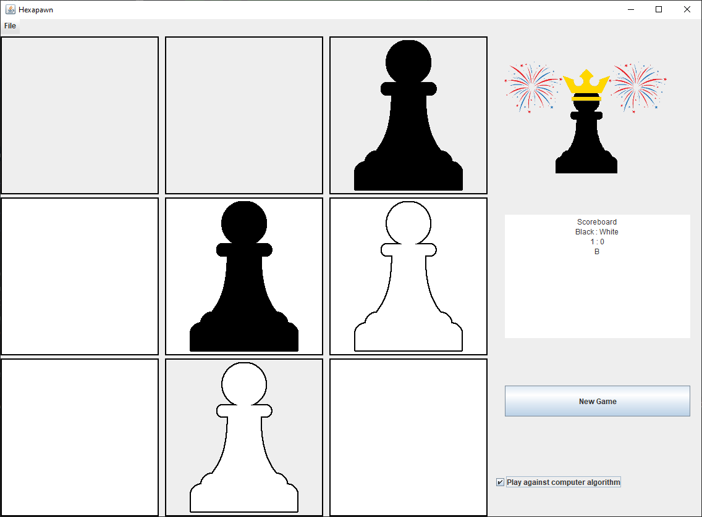

# Hexapawn

## **General**

Hexapawn is a simplified, 3x3 version of chess, which includes only pawns as playable figures. 

It's main purpose was to demonstrate machine learning using a "matchbox computer", which would improve for every round you played, until it was no longer beatable.

We've rebuilt this game in Java to try and implement the selfsame algorithm and get perfect play after just a couple of rounds of playing.

## **Features**
  #### **Game:**
  *   Playing player vs. player
  *   Playing against AI
  *   Scoreboard
  *   Resetting the game
  #### **AI:**
  *  Training the AI
  *  Saving the AI
  *  Opening the AI
  *  Resetting the AI

## **Preview**
Here is a small preview on how the game looks:

## **Authors**

- [Moritz Meyer](https://github.com/MoritzMy)
- [Michael Büttner](https://github.com/Miiichiiii)
